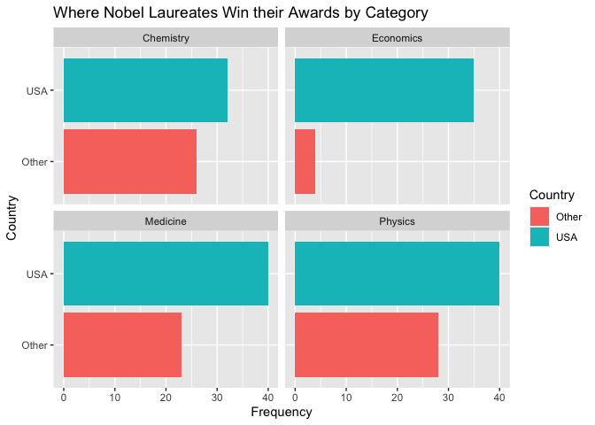

Lab 03 - Nobel laureates
================
Lily Botha
02/01/2026

### Load packages and data

``` r
library(tidyverse) 
```

``` r
nobel <- read_csv("data/nobel.csv")
```

## Exercises

Here is a link to the [lab
instructions](https://datascience4psych.github.io/DataScience4Psych/lab03.html).

### Exercise 1

There are 935 observations and 26 variables. Each row represents a
person/laureate.

### Exercise 2

``` r
nobel_living <- nobel %>% filter(is.na(died_date), !is.na(country), gender != "org") #create new filtered df
```

### Exercise 3

Remove this text, and add your answer for Exercise 1 here. Add code
chunks as needed. Don’t forget to label your code chunk. Do not use
spaces in code chunk labels.

``` r
nobel_living <- nobel_living %>% mutate(country_us = if_else(country == "USA", "USA", "Other")) #create new variable based on if statement: if country = "USA", set country_us to "USA", if not, set to "Other"
```

``` r
nobel_living_science <- nobel_living %>% filter(category %in% c("Physics", "Medicine", "Chemistry", "Economics")) #filter by observations within a specific column (category)
```

``` r
nobel_living_science %>% ggplot(mapping = aes(x = country_us, fill = country_us)) + geom_bar() + facet_wrap(~category) + labs(title = "Category of Nobel Prize vs. Location Won", subtitle = "where Nobel laureates were based when they won", x = "Country", fill = "Country") + coord_flip()
```

<!-- -->

### Exercise 4

…

### Exercise 5

…

### Exercise 6

…
